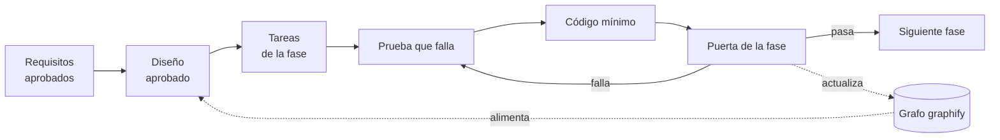

# Especificación 2.9.0 — Vigilancia confiable y avisos

Desarrollo guiado por especificación (SDD): primero **qué** debe cumplirse
(requisitos), luego **cómo** (diseño), luego **en qué orden** (tareas), y
recién entonces el código. Ninguna fase se codifica sin que su parte de esta
especificación esté aprobada.

| Documento | Contenido | Pregunta que responde |
| :--- | :--- | :--- |
| [requisitos.md](requisitos.md) | Historias, criterios de aceptación (EARS) con identificador, requisitos no funcionales, fuera de alcance, decisiones abiertas | ¿Qué tiene que pasar para que esté bien? |
| [diseno.md](diseno.md) | Arquitectura sobre el grafo actual, módulos y capas, modelo de estado, algoritmos, contratos de canal, amenazas, cuota | ¿Cómo se construye sin romper lo que hay? |
| [tareas.md](tareas.md) | 11 fases secuenciales con la misma estructura, tareas con prueba primero, trazabilidad a requisitos y puerta de salida | ¿En qué orden, y cómo sé que terminé cada paso? |
| ADR [0021](../../adr/0021-vigilancia-por-marca-y-tramos-de-una-pagina.md)–[0026](../../adr/0026-un-nucleo-dos-modos-gateway-y-daemon.md) | Las decisiones que el diseño fija, aceptadas el 7-oct | ¿Por qué así y no de otra forma? |

Origen: la revisión del daemon del 7-oct-2026 (roadmap, «Plan 2.9.0») y la
conversación sobre gateways siempre encendidos (OpenClaw, Hermes) con
Telegram.

## Flujo de trabajo

1. **Requisitos → diseño → tareas.** Si al diseñar aparece un requisito nuevo,
   se agrega primero en `requisitos.md` con su identificador. Si al codificar
   el diseño no alcanza, se corrige `diseno.md` antes de seguir, no después.
2. **Prueba primero.** Cada tarea nombra el test que la demuestra. El test se
   escribe, se ve fallar y recién entonces se escribe el código. Las tareas
   de los bloques críticos (fases 2 y 3) se comprueban además con mutación:
   romper a mano la línea clave debe hacer fallar el test.
3. **El grafo es parte del diseño.** El diseño parte del grafo de graphify
   actualizado el 7-oct (1.202 nodos, 0 ciclos de importación). Cada puerta
   de fase lo actualiza (`graphify update .`, sin modelo) y la regla de capas
   la vigila un test de arquitectura (tarea T1.2), no la memoria.
4. **Trazabilidad.** Cada requisito tiene al menos una tarea y un test; cada
   tarea dice qué requisitos cubre. La matriz está al final de `tareas.md`. Un
   requisito sin test no está cumplido, aunque el código exista.

## Puerta común (al cerrar cada fase)

Además de la puerta propia de cada fase en `tareas.md`:

- [ ] `npx tsc --noEmit` y `npm run lint` sin errores.
- [ ] `npm test` verde con `TZ` en `America/Santiago`, `UTC` y `Asia/Tokyo`.
- [ ] `npm run test:coverage` sobre el umbral; los módulos nuevos ≥ 80 % de líneas.
- [ ] `graphify update .` y el reporte sin ciclos de importación; el test de arquitectura en verde.
- [ ] Búsqueda de secretos: ningún valor de prueba de ticket, token, secreto ni clave en logs, avisos, estado ni respuestas (test T1.3).
- [ ] `CHANGELOG.md` bajo `[Unreleased]`, commit convencional en español con el porqué.
- [ ] El estado de la fase y de sus tareas actualizado en `tareas.md`.

## Estado

| Fase | Nombre | Estado |
| :--- | :--- | :--- |
| 0 | Preparación: decisiones, mediciones y base | ✅ 7-oct ([medición](../../qa/medicion-ventanas.md)) |
| 1 | Cimientos compartidos | ✅ 7-oct |
| 2 | Vigilancia sin huecos | ✅ 7-oct |
| 3 | Bandeja de salida y formato | 🔄 Siguiente |
| 4 | Canal Telegram | ⏸ |
| 5 | Canal webhook | ⏸ |
| 6 | Canal correo | ⏸ |
| 7 | Salud y cuota | ⏸ |
| 8 | Superficie: herramientas MCP, CLI y daemon | ⏸ |
| 9 | Instalación y documentación | ⏸ |
| 10 | Validación y cierre | ⏸ |
