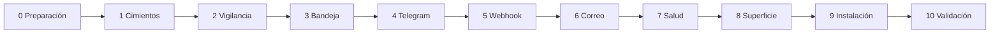

# Tareas — 2.9.0 Vigilancia confiable y avisos

Once fases en orden. Cada una tiene la misma estructura:

- **Objetivo:** qué queda funcionando al cerrar la fase.
- **Cubre:** qué requisitos de [requisitos.md](requisitos.md) satisface.
- **Entra:** qué debe estar cerrado antes de empezar.
- **Tareas:** cada una con el test que la demuestra, que se escribe antes que el código.
- **Sale:** qué queda entregado.
- **Puerta:** la condición propia de la fase, más la puerta común del [README](README.md).

Las fases 4, 5 y 6 (los canales) son independientes entre sí, pero se hacen
en ese orden: Telegram valida la interfaz `Canal` con el caso más simple
antes de sumar firma (webhook) y una dependencia (correo).

---

## Fase 0 — Preparación: decisiones, mediciones y base ✅ (7-oct-2026)

**Objetivo:** que todo lo que el diseño supone esté medido o decidido, sin
escribir código de producto.
**Cubre:** R2.3, NF3 (insumos); aprueba requisitos, diseño y ADR.
**Entra:** esta especificación escrita (7-oct-2026).

| Id | Tarea | Prueba / evidencia | Dónde queda |
| :--- | :--- | :--- | :--- |
| T0.1 ✅ | El dueño resuelve D1–D5 (aceptó las propuestas) | Decisiones anotadas con fecha | `requisitos.md`, «Decisiones abiertas» |
| T0.2 ✅ | Medir en la API real la semántica de `cambio_desde`/`cambio_hasta`: ¿bordes incluidos?, ¿resolución en segundos o minutos?, ¿`total_resultados` exacto con esos filtros? | 3 ventanas contiguas cuyos totales sumen el de la ventana completa; un cambio justo en el borde | `docs/internals/qa/medicion-ventanas.md` |
| T0.3 ✅ | Medir el retraso de indexación: cuánto tarda un cambio en aparecer en la ventana que le corresponde | Repetir la misma ventana pasada a +1, +5 y +15 min y comparar totales | Ídem; fija `solape` |
| T0.4 ✅ | Medir el volumen de cambios publicados por hora durante un día hábil (24 consultas de 1 página) y la distribución de presupuestos | Tabla hora a hora; percentiles de presupuesto | Ídem; fija intervalo, consultas/día y presupuesto mínimo (R2.3) |
| T0.5 ✅ | Línea base del grafo: `graphify update .`, guardar el reporte y la tabla de capas | Reporte con 0 ciclos | `diseno.md` §1 (ya hecho el 7-oct; repetir si cambió `src/`) |
| T0.6 ✅ | Revisar y aprobar `requisitos.md`, `diseno.md` y ADR 0021–0026 | Las ADR pasan de «propuesta» a «aceptada», con fecha | `docs/internals/adr/` |

**Presupuesto de cuota de la fase:** ~40 consultas; se usaron 40.

**Resultado:** [medicion-ventanas.md](../../qa/medicion-ventanas.md). La API registra los cambios en lotes cada 5 minutos con una sola marca, así que el diseño cambió de «tramos de una página divididos por tiempo» a «lectura lote por lote con comprobación de consistencia» (ADR 0021 reescrita). Queda por repetir T0.3 en horario hábil, en la fase 10.

**Sale:** constantes del diseño confirmadas o corregidas, ADR aceptadas y decisiones del dueño anotadas.

**Puerta:** ninguna celda de `diseno.md` §4 y §11 dice «a confirmar» o «medido en T0.x».

---

## Fase 1 — Cimientos compartidos ⏸

**Objetivo:** extraer y preparar lo que las fases siguientes usan, sin
cambiar ningún comportamiento visible.
**Cubre:** NF4, NF5; base de R1.7, R1.8 y R4.5.
**Entra:** fase 0 cerrada.

| Id | Tarea | Prueba primero | Archivos |
| :--- | :--- | :--- | :--- |
| T1.1 | Extraer la escritura atómica de `cache.ts` y el bloqueo de `rate-limiter.ts` a módulos propios. `cache.ts` y `rate-limiter.ts` pasan a usarlos | `archivo-atomico.test.ts`: corte simulado entre escribir y renombrar deja el archivo anterior intacto. `bloqueo.test.ts`: dos tomas a la vez, una espera; un bloqueo viejo se libera. Los tests existentes de caché y cuota, sin cambios | `utils/archivo-atomico.ts`, `utils/bloqueo.ts` |
| T1.2 | Test de arquitectura: lee los `import` de `src/` y verifica las reglas de `diseno.md` §2 y 0 ciclos. Las 3 deudas actuales figuran como excepciones con nombre | `arquitectura.test.ts`: falla si se agrega un `import` de `tools/` en `api/` (comprobado con mutación) | `test/arquitectura.test.ts` |
| T1.3 | Test de secretos: arranca el núcleo con valores de prueba para ticket, token, secreto, URL y clave; recorre logs, estado, avisos y respuestas, y exige 0 apariciones | `secretos.test.ts` (se amplía en cada fase con los caminos nuevos) | `test/secretos.test.ts` |
| T1.4 | API simulada de cambios: catálogo con un reloj controlable, lotes cada 5 minutos con una sola marca, bordes incluidos (semántica de T0.2), cantidad configurable por lote y región, 504 programables y procesos que vuelven a cambiar (pasan al lote siguiente) entre dos páginas de una lectura | `mock-cambios.test.ts`: una ventana entre marcas da 0; una de ancho cero sobre la marca da el lote; la suma de ventanas contiguas cuenta dos veces el borde, como la API real | `scripts/qa/mock-api.mjs` (modo `CAMBIOS`), `scripts/qa/catalogo-cambios.mjs` |
| T1.5 | Reloj de prueba: un `ahora()` inyectable para el núcleo (el de producción sigue siendo `utils/reloj.ts`) | Los tests de las fases 2 a 7 avanzan horas en milisegundos | `test/ayudas/reloj-falso.ts` |

**Sale:** los cimientos probados y la API simulada con cambios. El comportamiento del servidor queda igual (la suite anterior sigue verde sin tocar sus aserciones).

**Puerta:** el test de arquitectura y el de secretos están en la CI.

---

## Fase 2 — Vigilancia sin huecos ⏸

**Objetivo:** el ciclo nuevo revisa todo lo que cambió, se recupera de los
fallos y lo dice cuando no puede.
**Cubre:** R1.1–R1.10, R2.1, R2.4, NF6.
**Entra:** fase 1 cerrada (bloqueo, escritura atómica, API simulada de cambios, reloj falso).

| Id | Tarea | Prueba primero | Archivos |
| :--- | :--- | :--- | :--- |
| T2.1 | Modelo de estado v2, carga, guardado atómico bajo bloqueo, poda y migración desde `.monitor-state.json` | `estado-vigilancia.test.ts`: migración conserva la dedupe; poda por antigüedad; archivo corrupto → estado vacío con aviso, sin excepción | `vigilancia/estado.ts` |
| T2.2 | Lotes: marcas desde la siguiente a la marca hasta la última asentada, consulta de un lote (marca a marca + 4:59), tope de recuperación con hueco, comprobación de consistencia | `lotes.test.ts`: marcas en el cambio de horario de septiembre; ninguna marca saltada ni repetida; consistencia con totales y códigos | `vigilancia/lotes.ts` |
| T2.3 | Criterios: mover `coincidenciaDeAlerta`, sumar exclusiones, regiones y «solo sin ofertas», leer las variables `MONITOR_*` actuales | `criterios.test.ts`: los casos de `ciclo-monitor.test.ts` siguen pasando; casos nuevos de exclusión y región | `vigilancia/criterios.ts` |
| T2.4 | Ciclo: lotes en orden, páginas con comprobación, relectura y región, lotes pendientes ante errores, marca contigua, presupuesto de tiempo con avance parcial | `ciclo-vigilancia.test.ts` contra la API simulada: (a) lotes de 35 durante una hora → todos revisados; (b) 504 en 3 ciclos seguidos → los lotes se recuperan; (c) proceso que pasa al lote siguiente entre dos páginas → la comprobación lo detecta y la relectura no pierde ninguno; (d) corte a mitad → ni pérdida ni duplicado; (e) lote de 150 → se lee por región; (f) lote que no cuadra ni por región → incompleto informado | `vigilancia/ciclo.ts` |
| T2.5 | Vigilante único con latido; un vigilante muerto se reemplaza | `vigilante.test.ts`: dos procesos, uno ejecuta; PID inexistente → se toma | `vigilancia/vigilante.ts` |
| T2.6 | El daemon (`services/monitor.ts`) pasa al núcleo nuevo, todavía escribiendo en `alerts.log`. Se borran `ciclo-monitor.ts` y `estado-monitor.ts` | `monitor-proceso.test.ts`: el daemon arranca contra la API simulada, escribe una alerta y el estado v2 | `services/monitor.ts` |

**Mutación obligatoria:** romper a mano la condición de avance de la marca (T2.4) y la comprobación de consistencia (T2.2): algún test debe fallar en cada caso.

**Sale:** el daemon con la vigilancia completa (los avisos siguen en el log).

**Puerta:** los casos (a)–(e) de T2.4 en verde; `graphify update .` muestra `vigilancia/` sin dependencias hacia `tools/`.

---

## Fase 3 — Bandeja de salida y formato ⏸

**Objetivo:** cada alerta se convierte en avisos por canal que sobreviven a
reinicios y fallos, con contenido limpio.
**Cubre:** R3.1–R3.5, R4.1–R4.3, R4.6.
**Entra:** fase 2 cerrada (alertas del núcleo nuevo).

| Id | Tarea | Prueba primero | Archivos |
| :--- | :--- | :--- | :--- |
| T3.1 | `Alerta` y `crearAlerta()`: campos de R4.1, nombre recortado, `sinContactos`, sin descripción | `mensaje.test.ts`: con el fixture real de `enjambre2-detalles.json`, ningún teléfono ni correo en la alerta | `avisos/mensaje.ts` |
| T3.2 | Interfaz `Canal`, `ResultadoEnvio` y clasificación transitorio/permanente | `canal.test.ts`: tabla de códigos HTTP y errores de red → tipo | `avisos/canal.ts` |
| T3.3 | Bandeja: estados, id estable, lotes por canal, espera creciente, 8 intentos, silencio con `paredDeChile(ahora())`, retención y resumen | `bandeja.test.ts`: canal que falla 2 veces y entrega; 400 → fallido sin reintento; reinicio con pendientes; silencio de 22:00 a 07:00 con el cambio de horario de septiembre | `avisos/bandeja.ts` |
| T3.4 | Formateadores puros de Telegram, correo y webhook, con su escapado y división por tope | `formato-avisos.test.ts`: nombre con `<script>`, `&` y saltos de línea; lote de 60 procesos dividido en mensajes ≤ 4.096 caracteres; asunto de una línea | `avisos/formato/*.ts` |
| T3.5 | Conectar el ciclo con la bandeja (`encolar`) | `ciclo-vigilancia.test.ts`: una alerta nueva genera un aviso por canal activo | `vigilancia/ciclo.ts` |

**Mutación obligatoria:** quitar el escapado en un formateador; quitar el «no reintentar» del permanente.

**Sale:** la bandeja con un canal falso de prueba. Todavía no hay canales reales.

**Puerta:** `secretos.test.ts` ampliado a los avisos formateados.

---

## Fase 4 — Canal Telegram ⏸

**Objetivo:** los avisos llegan a Telegram.
**Cubre:** R5.1–R5.4, R4.5 (token).
**Entra:** fase 3 cerrada; D2 resuelta.

| Id | Tarea | Prueba primero | Archivos |
| :--- | :--- | :--- | :--- |
| T4.1 | Configuración: leer y validar token y chat id, registrar el token como secreto | `config-avisos.test.ts`: faltante → error claro; el token no aparece en el error | `avisos/config.ts` |
| T4.2 | Canal: `sendMessage`, ritmo de 1 por segundo, `retry_after`, clasificación | `canal-telegram.test.ts` contra una Bot API simulada (200, 429 con `retry_after`, 403, 400 de entidades) | `avisos/canales/telegram.ts`, `scripts/qa/mock-telegram.mjs` |
| T4.3 | `--telegram-chat-id`: `getUpdates` y mostrar el último chat | `cli-telegram.test.ts` contra la simulación | `cli/avisos.ts` |
| T4.4 | Prueba manual con un bot real del dueño | Captura del mensaje recibido, sin token visible | Nota en `docs/internals/qa/` |

**Sale:** el daemon avisa por Telegram.

**Puerta:** la prueba real de T4.4 recibida y anotada.

---

## Fase 5 — Canal webhook ⏸

**Objetivo:** cualquier sistema puede recibir las alertas firmadas.
**Cubre:** R6.1–R6.4, R4.5 (secreto y URL).
**Entra:** fase 4 cerrada.

| Id | Tarea | Prueba primero | Archivos |
| :--- | :--- | :--- | :--- |
| T5.1 | Esquema `compra_agil.alertas` v1 y su documentación, con ejemplos de verificación en Node y Python | `webhook-esquema.test.ts`: el cuerpo generado valida contra el esquema publicado | `docs/api/webhook-alertas.md` |
| T5.2 | Canal: firma, `Idempotency-Key`, `https` obligatorio salvo local, corte a 10 s | `canal-webhook.test.ts` con un receptor local: firma válida con el código de la documentación; 503 → reintento; 400 → fallido; `http://` externo rechazado al configurar | `avisos/canales/webhook.ts` |
| T5.3 | Ejecutar el ejemplo en Python de la documentación en la CI (si hay Python en el runner) | Paso de la CI que verifica una firma generada por Node | `.github/workflows/ci.yml` |

**Sale:** el webhook funcionando y documentado para integradores.

**Puerta:** los dos ejemplos de verificación de la documentación pasan contra una firma real.

---

## Fase 6 — Canal correo ⏸

**Objetivo:** el resumen diario y los fallos llegan por correo.
**Cubre:** R7.1–R7.3, NF1.
**Entra:** fase 5 cerrada; D3 resuelta.

| Id | Tarea | Prueba primero | Archivos |
| :--- | :--- | :--- | :--- |
| T6.1 | Agregar `nodemailer` y revisar su `npm audit` y su licencia | `npm audit --omit=dev` en 0; licencia MIT | `package.json` |
| T6.2 | Canal: TLS obligatorio, texto y HTML, asunto de una línea, clasificación | `canal-correo.test.ts` contra un servidor SMTP en proceso: entrega; `EAUTH` → fallido sin la clave en el texto | `avisos/canales/correo.ts` |
| T6.3 | Prueba manual con la cuenta del dueño | Correo recibido, anotado | Nota en `docs/internals/qa/` |

**Sale:** tres canales operativos.

**Puerta:** `nodemailer` es la única dependencia nueva de producción (NF1).

---

## Fase 7 — Salud y cuota ⏸

**Objetivo:** el silencio deja de ser ambiguo y la cuota no se agota sola.
**Cubre:** R8.1–R8.5, NF3.
**Entra:** fase 6 cerrada (hay canales para avisar).

| Id | Tarea | Prueba primero | Archivos |
| :--- | :--- | :--- | :--- |
| T7.1 | Ceguera y recuperación: episodio, un solo aviso, aviso de vuelta con rango y huecos | `salud.test.ts` con reloj falso: 3 h de 504 → 1 aviso de ceguera y 1 de recuperación | `vigilancia/salud.ts` |
| T7.2 | Resumen diario a la hora configurada, una vez por día de Chile | Ídem: cruza la medianoche y el cambio de horario sin duplicar | Ídem |
| T7.3 | Fallo de un canal avisado por otro a los 3 fallos seguidos | `bandeja.test.ts`: Telegram cae y avisa el correo | `avisos/bandeja.ts` |
| T7.4 | Proyección de cuota y espaciado ante 429 o exceso | `salud.test.ts`: con el volumen de T0.4 la proyección por defecto cabe en NF3; con un 429, el intervalo se duplica y se avisa una vez | `vigilancia/salud.ts` |

**Sale:** la vigilancia completa y honesta en modo daemon.

**Puerta:** una simulación de 6 h acelerada con fallos programados, sin procesos ni avisos perdidos (adelanto de la fase 10).

---

## Fase 8 — Superficie: herramientas MCP, CLI y daemon ⏸

**Objetivo:** el gateway y el dueño pueden usar todo desde el chat o la terminal.
**Cubre:** R2.2, R9.1–R9.4, R10.1, R10.2.
**Entra:** fase 7 cerrada.

| Id | Tarea | Prueba primero | Archivos |
| :--- | :--- | :--- | :--- |
| T8.1 | `estado_vigilancia` | `servidor-en-proceso.test.ts`: refleja pendientes, incompletos, canales y vigilante vivo | `tools/vigilancia.ts` |
| T8.2 | `obtener_alertas_nuevas` y `confirmar_alertas` con lotes y reoferta a los 30 min | Ídem: lote sin confirmar vuelve; confirmado no; avance parcial dentro de los 45 s | Ídem |
| T8.3 | `probar_avisos` sin parámetros de destino | Ídem: el esquema de la herramienta no tiene campos de URL, chat ni correo | Ídem |
| T8.4 | `configurar_criterios` con aviso del cambio (antes y después) | Ídem: criterios vacíos → aviso enviado por cada canal | Ídem |
| T8.5 | CLI `--check`, `--vigilar`, `--probar-avisos` en el `bin` | `cli-check.test.ts`: todo bien → 0; ticket malo → 1 y una línea que lo dice sin mostrarlo | `cli/check.ts`, `index.ts` |
| T8.6 | Actualizar `protocolo.test.ts` (21 herramientas), `instrucciones.ts` y las anotaciones | `protocolo.test.ts`, `instrucciones.test.ts` | — |

**Sale:** los dos modos (gateway y daemon) completos.

**Puerta:** un cliente MCP real (Claude Code) ejecuta el ciclo gateway completo (obtener → confirmar) contra la API simulada.

---

## Fase 9 — Instalación y documentación ⏸

**Objetivo:** un agente instala y deja encendida la vigilancia sin ayuda.
**Cubre:** R10.3–R10.5, NF8.
**Entra:** fase 8 cerrada; D1 resuelta.

| Id | Tarea | Prueba / evidencia | Archivos |
| :--- | :--- | :--- | :--- |
| T9.1 | Script de tarea programada de Windows (instalar y quitar), con reinicio ante fallo | Instalada y reiniciada en el equipo del dueño | `scripts/instalar-tarea-windows.ps1`, `scripts/quitar-tarea-windows.ps1` |
| T9.2 | Unidad de systemd de usuario de ejemplo | Probada en la CI de Ubuntu con `systemd-analyze verify` | `scripts/compra-agil-vigilancia.service` |
| T9.3 | Rotación del log del daemon | `log-rotacion.test.ts` | `services/monitor.ts` |
| T9.4 | Guías de OpenClaw y Hermes: registrar el MCP sin secretos, tarea programada del gateway, `--check` | Seguidas paso a paso por un agente en la fase 10 | `docs/api/guia-gateway-openclaw.md`, `docs/api/guia-gateway-hermes.md` |
| T9.5 | README: sección «Vigilancia y avisos» e «Instalación por un agente»; corregir lo que hoy promete el daemon. Manual del servidor, `.env.example`, glosario | Enlaces y anclas verificados con `github-slugger` | `README.md`, `docs/api/manual_servidor_mcp.md`, `.env.example` |

**Sale:** todo documentado y con instaladores.

**Puerta:** `.env.example` lista cada variable de `diseno.md` §7 sin ningún valor real.

---

## Fase 10 — Validación y cierre ⏸

**Objetivo:** demostrar con evidencia que no se pierde nada, y publicar.
**Cubre:** NF2 y la validación de todos los R.
**Entra:** fases 0–9 cerradas.

| Id | Tarea | Evidencia | Dónde queda |
| :--- | :--- | :--- | :--- |
| T10.1 | Simulación de 24 h acelerada: ráfagas de 504, horas con más de 100 cambios, reinicios, un canal caído, 429 de Telegram | 0 procesos perdidos, 0 avisos perdidos, repetidos solo con el mismo id; latencia ≤ intervalo + 2 min (NF2) | `docs/internals/qa/resultado-vigilancia-24h.md` |
| T10.2 | Enjambre: un agente instala desde cero siguiendo solo la guía del gateway elegido | Dónde se trabó y qué se corrigió | `docs/internals/qa/resultado-instalacion-agente.md` |
| T10.3 | Semana real en el equipo del dueño, con Telegram y el resumen diario por correo; cada mañana se contrasta un día contra el buscador | Tabla diaria: procesos esperados, avisados y faltantes con su causa | `docs/internals/qa/resultado-semana-real.md` |
| T10.4 | Cerrar CHANGELOG `[2.9.0]`, publicar en npm, tag y release (el flujo ya reconoce la versión publicada a mano) | Versión en npm y release | — |

**Puerta (definición de cerrada de la 2.9.0):**
1. Todas las puertas de fase cerradas.
2. T10.1 sin pérdidas.
3. T10.3 con 0 faltantes atribuibles al servidor. Los faltantes por caída de la API deben haberse informado como ceguera o hueco.
4. Ningún secreto en ningún texto (T1.3 en verde).

---

## Matriz de trazabilidad

| Requisito | Tareas | Test principal |
| :--- | :--- | :--- |
| R1.1–R1.6 | T2.2, T2.4 | `lotes.test.ts`, `ciclo-vigilancia.test.ts` |
| R1.7 | T1.1, T2.5 | `bloqueo.test.ts`, `vigilante.test.ts` |
| R1.8 | T1.1, T2.1, T2.4 | `archivo-atomico.test.ts`, `ciclo-vigilancia.test.ts` (d) |
| R1.9 | T2.1, T2.3 | `estado-vigilancia.test.ts` |
| R1.10 | T2.2 | `lotes.test.ts` |
| R2.1, R2.4 | T2.3 | `criterios.test.ts` |
| R2.2 | T8.4 | `servidor-en-proceso.test.ts` |
| R2.3 | T0.4, T2.3 | `medicion-ventanas.md`, `criterios.test.ts` |
| R3.1–R3.5 | T3.3, T3.5 | `bandeja.test.ts` |
| R4.1, R4.2, R4.6 | T3.1 | `mensaje.test.ts`, `secretos.test.ts` |
| R4.3 | T3.4 | `formato-avisos.test.ts` |
| R4.4 | T8.3, T4.1, T5.2 | `servidor-en-proceso.test.ts` (sin campos de destino) |
| R4.5 | T1.3, T4.1, T5.2, T6.2 | `secretos.test.ts` |
| R5.1–R5.4 | T4.1–T4.4 | `canal-telegram.test.ts`, `cli-telegram.test.ts` |
| R6.1–R6.4 | T5.1–T5.3 | `canal-webhook.test.ts`, `webhook-esquema.test.ts` |
| R7.1–R7.3 | T6.1–T6.3 | `canal-correo.test.ts` |
| R8.1–R8.5 | T7.1–T7.4 | `salud.test.ts`, `bandeja.test.ts` |
| R9.1–R9.4 | T8.1, T8.2 | `servidor-en-proceso.test.ts` |
| R10.1, R10.2 | T8.3, T8.5 | `cli-check.test.ts` |
| R10.3–R10.5 | T9.1–T9.4 | `log-rotacion.test.ts`, evidencia de T9.1 y T10.2 |
| NF1 | T6.1 | `package.json` |
| NF2 | T10.1 | `resultado-vigilancia-24h.md` |
| NF3 | T0.4, T7.4 | `salud.test.ts` |
| NF4 | T1.2 | `arquitectura.test.ts` |
| NF5 | T1.5 | Revisión de la puerta de cada fase |
| NF6 | T2.1 | `estado-vigilancia.test.ts` |
| NF7 | Puerta común | `test:coverage` |
| NF8 | T9.2 y la CI | Matriz Ubuntu/Windows × Node 20/22 |
